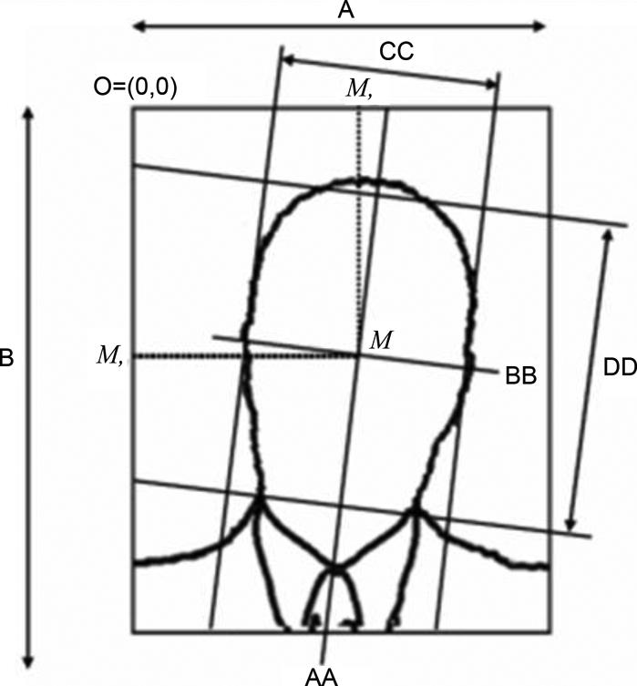

BIOLAB -ICAO 人脸质量评估相关项目

|编号|项目|标准|
|------|------| -----| 
|1|眼睛定位的精度|这一项和检测算法相关，可以不考虑|
|2|人脸定位的精度|也是检测算法相关的参数|
|3|双眼瞳孔中心距离|最小90像素|
|4|人脸纵坐标位置|$0.3B \le M_y \le 0.5B$,示意图在表格上面|
|5|人脸横坐标位置|$0.45A \le M_x \le 0.55A$,示意图在表格上面|
|6|人脸宽度占比|$0.5A \le CC \le 0.75A$|
|7|人脸高度占比|$0.6B \le DD \le 0.9B$|
|8|模糊程度|论文中的值是用算法计算的0-100|
|9|眼神位置|0-100,人脸看向正前方是100,图片中没有眼睛为0|
|10|墨水标记/折痕|0-100,没有时为100|
|11|不自然的肤色|0-100,人脸肤色和标准肤色的色差|
|12|图片太暗/太亮|0-100,太暗或太亮分数都底|
|13|图片褪色|0-100,褪色图片会比自然图片的灰度范围有减小|
|14|像素化|0-100,图片中有小的方块一样的像素点|
|15|头发盖住了眼睛|0-100|
|16|眼睛睁开|0-100,0闭上，100张开|
|17|背景多变|0-100,背景越复杂，分数越低|
|18|人脸滚动/俯仰/偏航角 小于8度|0-100|
|19|皮肤上的闪光反射|0-100|
|20|红眼睛|0-100,拍照不会时会出现|
|21|头后面的阴影|没有阴影的效果最好|
|22|脸上的阴影|没有阴影最好|
|23|人脸带有深色镜片|没有镜片最好|
|24|镜头上有闪光反射|没有反射最好|
|25|是否戴有眼镜|不戴最好|
|26|眼镜挡住眼镜|没挡住最好|
|27|是否戴帽|没有最好|
|28|脸上有面纱|没有最好|
|29|嘴巴张开|没张开的图片最好|
|30|附近是否有和人脸相近的物品|没有最好|